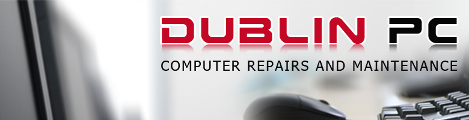
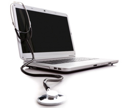

# Co. Dublin based PC support, repair, maintenance service. Virus removal. Screen colour calibration

#### Call [085 733 8886](tel:+353857338886) or [email](/contacts/)
::: tip WE SPEAK:
*[English](/), [Russian](/ru/), [Lithuanian](/lt/)*
:::

**Services:**

- Computer speedup and optimisation
- Computer repair services
- Laptop repair services
- [Monitor colour calibration](/monitor-colour-calibration-services-dublin/) (Precisely measure all types of displays – including LCDs, - LEDs, wide gamut displays, CRTs and laptops) for colour accuracy.
- Laptop DC jack repair
- Virus + spyware Removal
- Computer security and protection
- Broken screen repair/replacement
- Hard disk drive (HDD) upgrade or replacement
- Parts and upgrades
- Wired or wireless network installation
- New computer installation and configuration
- Operating system recovery/installation
- Remote computer support