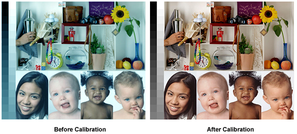

---
meta:
  - name: description
    content: Why is monitor colour calibration important to You? Is your edited photo being seen by your friends in the same way as it is by you? ... Services in Dublin.
---

# Monitor colour calibration services in Dublin

Why is monitor colour calibration important to You?
Is your edited photo being seen by your friends in the same way as it is by you? Monitors used by amateurs are rarely calibrated, therefore, colours and tones appear different then they are.

A properly calibrated monitor is essential for colour critical work such as digital photography or graphic design. A calibrated screen gives you a trusted source for viewing your images.

We can calibrate your monitor or laptop screen (CCFL, Wide-Gamut CCFL, White LED, Retina Dipslay, RGB LED, CRT) to get the ultimate in accurate colour display.

Please contact to arrange the service.

Price: **€35-50**. Also you can get it free with windows re-installation services.

