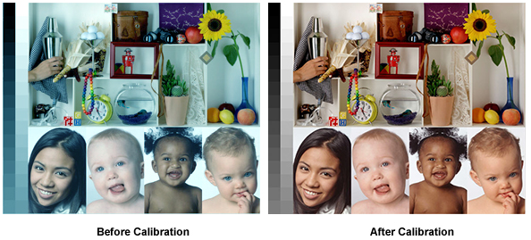

---
meta:
  - name: description
    content: калибровка экрана компьютера в Дублине Ирландия. Цена €25.
---
# калибровка экрана компьютера в Дублине Ирландия

Что дает цветовaя калибровка монитора?

Цвета изображений в компьютере записаны в виде комбинаций трех цветовых составляющих: красного, зеленого и синего. Однако, при выводе изображения каждый монитор будет отображать один и тот же цвет в зависимости от собственных настроек. На двух абсолютно одинаковых мониторах, настройки контрастности и гаммы которых выставлены по-разному, один и тот же цвет будет кардинально различаться, несмотря на то что на них поступили совершенно одинаковые команды по выводу изображения. Сложившаяся ситуация не позволяет избежать нестыковок цвета при использовании различных моделей мониторов, поскольку каждая модель воспринимает и воспроизводит одни и те же цвета по-разному.

::: tip Мы можем калибрировать такие типы:
CCFL, Wide-Gamut CCFL, White LED, RGB LED, CRT, Retina Display
:::

В некоторых случаях мы посоветуем вам, когда вам нужно приобрести свой калибратор.

Пожалуйста [напишите](/ru/kontakt/) договарится о сервисе.

Цена €35.